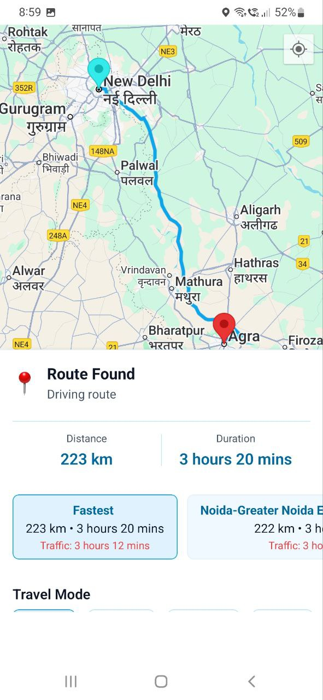
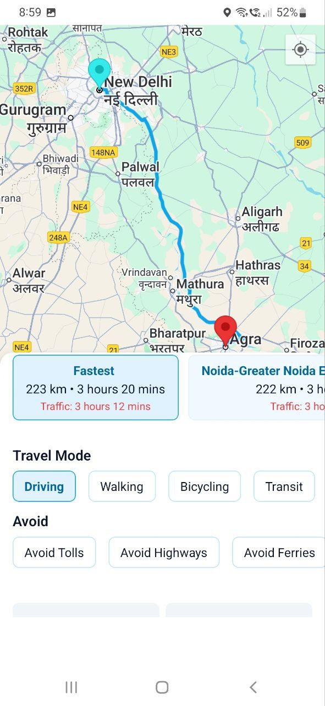
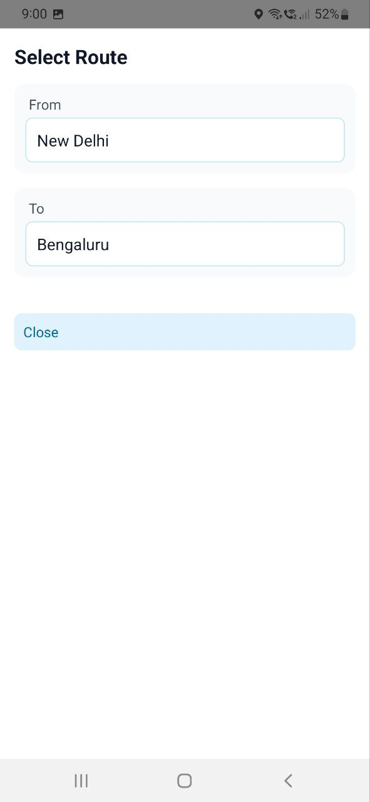

# 🗺️ PathFinder - Smart Route Optimization App

A React Native mobile application built with Expo that provides intelligent route planning with multiple alternatives, real-time traffic data, and optimized navigation suggestions.

<!-- ## APK link : https://expo.dev/accounts/toshoyeb/projects/pathfinder/builds/06abab1a-f38f-4000-b476-e4d218363ef7 -->


APK LINK: https://expo.dev/accounts/toshoyeb/projects/pathfinder/builds/5e212037-2656-428c-9b0b-7db61798e71a

## 📸 App Screenshots

<p align="center">
  
  
  
  
  
  
  
</p>

## ✨ Features

### 🔐 Authentication & Security
- **Firebase Authentication** with email/password
- **Protected route system** using Expo Router
- **Automatic session management** and redirects
- **Form validation** with user-friendly error messages

### 🗺️ Route Planning & Navigation
- **Multiple route alternatives** (up to 3 options per request)
- **Travel mode optimization** (driving, walking, bicycling, transit)
- **Real-time traffic data** with ETA updates
- **Eco-friendly routing** preferences for environmental consciousness
- **Smart route comparison** with distance, duration, and traffic info

### 🎯 User Experience
- **Auto-fallback system** - switches to driving mode when other modes fail
- **Smart error handling** with non-intrusive snackbar notifications
- **Interactive map** with tap-to-select destinations
- **Place search** with autocomplete functionality
- **Responsive design** with proper keyboard handling

### 🛠️ Technical Features
- **Custom polyline decoding** (no external dependencies)
- **Optimized state management** using React hooks + Firebase
- **Comprehensive error handling** with detailed logging
- **Modern UI components** with consistent design system

## 🏗️ Architecture

### Authentication & Navigation Strategy

```
app/
├── _layout.tsx           # Root layout - Auth controller & route protection
├── index.tsx            # Landing page (public)
├── login.tsx            # Login page (public)
├── signup.tsx           # Signup page (public)
└── (auth)/              # Protected route group
    ├── _layout.tsx      # Protected routes layout
    ├── home.tsx         # Dashboard (protected)
    └── directions.tsx   # Route planning (protected)
```

**Why No State Management Library?**
- Firebase Auth provides global authentication state management
- App scope is focused and doesn't require complex state sharing
- React's built-in hooks + Firebase listeners are sufficient
- Reduces bundle size and complexity

**Route Protection Logic:**
1. Root `_layout.tsx` monitors Firebase auth state
2. Uses Expo Router segments to detect current route group
3. Automatically redirects based on authentication status:
   - Authenticated users → `/(auth)/home`
   - Unauthenticated users → `/` (landing page)

### State Management Philosophy

```typescript
// Authentication State (Global)
Firebase Auth → onAuthStateChanged → Root Layout → Auto Navigation

// Component State (Local)
React useState/useEffect → Component-specific logic → UI Updates

// API State (Temporary)
Async operations → Loading states → Success/Error handling
```

## 🚀 Getting Started

### Prerequisites
- Node.js 18+ 
- Expo CLI: `npm install -g @expo/cli`
- Android Studio (for Android development)


### Installation

1. **Clone the repository**
   ```bash
   git clone <repository-url>
   cd pathFinder
   ```

2. **Install dependencies**
   ```bash
   npm install
   ```

3. **Configure Firebase**
   - Create a Firebase project at [https://console.firebase.google.com](https://console.firebase.google.com)
   - Enable Authentication with Email/Password provider
   - Download `google-services.json` and place in project root
   - Update Firebase configuration in `src/config/`

4. **Configure Google Maps API**
   - Get API key from [Google Cloud Console](https://console.cloud.google.com)
   - Enable: Maps SDK, Places API, Directions API
   - Add key to `src/config/api.ts`

5. **Start the development server**
   ```bash
   npx expo start
   ```

6. **Run on device/simulator**
   - Press `a` for Android emulator
   - Press `i` for iOS simulator
   - Scan QR code with Expo Go app for physical device

## 📁 Project Structure

```
pathFinder/
├── app/                          # Expo Router file-based routing
│   ├── _layout.tsx              # Root layout with auth logic
│   ├── index.tsx                # Landing page
│   ├── login.tsx                # Login screen
│   ├── signup.tsx               # Signup screen
│   └── (auth)/                  # Protected route group
│       ├── _layout.tsx          # Protected routes layout
│       ├── home.tsx             # Main dashboard
│       └── directions.tsx       # Route planning screen
├── src/
│   ├── components/              # Reusable UI components
│   │   └── ui/                  # Design system components
│   │       ├── Button.tsx       # Customizable button component
│   │       ├── Input.tsx        # Form input with validation
│   │       ├── Card.tsx         # Container component
│   │       └── FullScreenSearch.tsx # Place search modal
│   ├── services/                # API and external service integrations
│   │   ├── directionsService.ts # Google Directions API wrapper
│   │   └── placesService.ts     # Google Places API wrapper
│   ├── config/                  # Configuration files
│   │   └── api.ts              # API keys and endpoints
│   ├── constants/               # App-wide constants
│   │   ├── Colors.ts           # Color palette
│   │   └── Spacing.ts          # Layout spacing system
│   └── utils/                   # Utility functions
├── assets/                      # Static assets (images, animations)
└── android/                     # Android-specific files
```

## 🔧 Key Components

### Authentication Flow
```typescript
// Root Layout - Authentication Controller
app/_layout.tsx
├── Firebase Auth Listener
├── Route Protection Logic
├── Automatic Redirects
└── Loading States

// Login Page - User Sign-in
app/login.tsx
├── Form Validation
├── Firebase Auth Integration
├── Error Handling
└── Success Navigation (automatic)
```

### Route Planning System
```typescript
// Directions Service - Google API Integration
src/services/directionsService.ts
├── Multiple Route Alternatives
├── Travel Mode Support
├── Traffic Data Integration
├── Polyline Decoding
└── Error Handling

// Directions Screen - Route Planning UI
app/(auth)/directions.tsx
├── Interactive Map
├── Place Search
├── Route Comparison
├── Travel Mode Selection
└── Auto-fallback System
```

## 🎨 Design System

### Colors
- **Primary**: Various shades of blue for main actions
- **Error**: Red variants for error states and warnings
- **Background**: Light theme with primary/secondary backgrounds
- **Text**: Primary/secondary text colors for hierarchy

### Components
- **Button**: Variants (primary, secondary, ghost) with loading states
- **Input**: Form inputs with validation and error display
- **Card**: Container component with elevation variants
- **FullScreenSearch**: Modal component for place search

## 🔑 Environment Setup

### Required API Keys

1. **Google Maps API Key**
   ```typescript
   // src/config/api.ts
   export const GOOGLE_MAPS_API_KEY = "your_google_maps_api_key";
   ```

2. **Firebase Configuration**
   ```json
   // google-services.json (Android)
   {
     "project_info": {
       "project_id": "your-project-id"
     }
   }
   ```

### Permissions Required
- **Location**: For current location detection
- **Internet**: For API calls and authentication

## 🚨 Error Handling Strategy

### Authentication Errors
- Maps Firebase error codes to user-friendly messages
- Handles network connectivity issues
- Provides specific feedback for common problems

### Route Planning Errors
- **Auto-fallback system**: Switches to driving mode when other modes fail
- **Distance validation**: Prevents API calls for very short distances
- **Snackbar notifications**: Non-intrusive error messaging
- **UI resilience**: Ensures app remains interactive after errors

### API Error Management
```typescript
// Example error handling pattern
try {
  const routes = await getRoutesWithAlternatives(...);
  // Handle success
} catch (error) {
  if (error.message.includes("No routes found")) {
    // Auto-switch to driving mode
    setTravelMode("driving");
    showSnackbar("No routes found for walking. Trying driving...");
  } else {
    // Show generic error
    showSnackbar("Route planning failed. Please try again.");
  }
}
```

## 🧪 Development & Testing

### Running the App
```bash
# Start Expo development server
npx expo start

# Run on Android emulator
npx expo run:android

# Run on iOS simulator  
npx expo run:ios

# Build for production
npx expo build
```

### Debugging
- **Flipper integration** for React Native debugging
- **Console logging** for authentication and route planning flows
- **Error boundaries** for graceful error handling

## 📱 Supported Platforms
- **Android**: API level 21+ (Android 5.0+)
- **iOS**: iOS 13.0+
- **Expo Go**: For development and testing

## 🤝 Contributing

1. Fork the repository
2. Create a feature branch: `git checkout -b feature/amazing-feature`
3. Commit changes: `git commit -m 'Add amazing feature'`
4. Push to branch: `git push origin feature/amazing-feature`
5. Open a pull request

## 📄 License

This project is licensed under the MIT License - see the [LICENSE](LICENSE) file for details.

## 🙏 Acknowledgments

- **Expo Team** for the excellent development platform
- **Firebase** for authentication and backend services
- **Google Maps Platform** for mapping and routing APIs
- **React Native Community** for the robust ecosystem

---

**Built with ❤️ using Expo and React Native**
